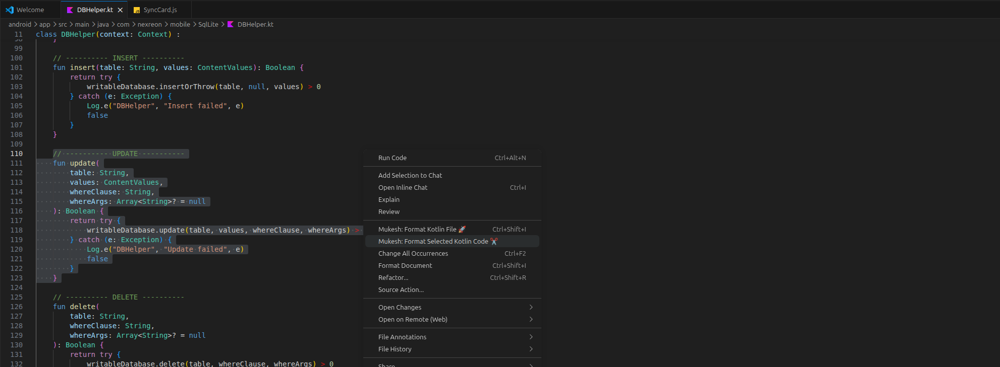
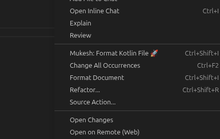
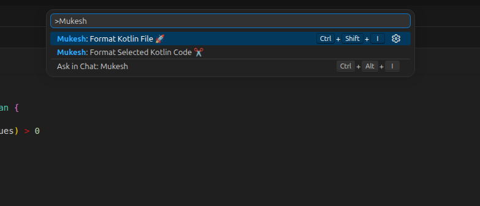

# Mukesh Kotlin Formatter 🚀

A fast and lightweight Kotlin formatter for Visual Studio Code powered by ktlint.

## ✨ Features

- Format Kotlin files instantly
- Clean and readable code
- Simple and fast execution

## 📸 Preview

## ⚡ Usage

1. Open any `.kt` or `.kts` file  
2. Press `Ctrl + Shift + P`  
3. Search for **Mukesh: Format Kotlin File 🚀**  
4. Hit Enter  

---

## ⌨️ Shortcut

- **Ctrl + Shift + I** → Format Kotlin file instantly ⚡

---

## 🔧 Requirements

- ktlint must be installed on your system  

---

## 🌐 Website

Visit: **https://yourwebsite.com**  
(Replace with your real site link)

---

## 📦 Installation

Install the extension via VSIX or VS Code Marketplace.

---

## 👨‍💻 Author

**Mukesh M**  
Full Stack Developer (Web, Android, iOS, Desktop)

---